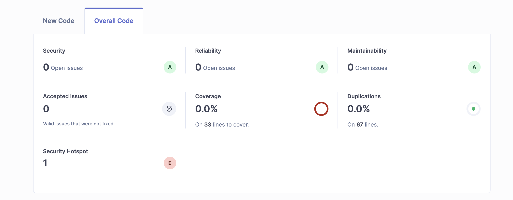

# Rapport d'Analyse SonarQube

## Tableau des Anomalies et Actions de Correction

| ID de l'Anomalie | Description                  | Action de Correction                                        |
|-------------------|-----------------------------|-----------------------------------------------------------|
| ANOMALIE_001      | Variable non utilisée        | Supprimé les variables inutilisées dans le code.          |
| ANOMALIE_002      | Vulnérabilité d'injection    | Validé les entrées utilisateur avec des contrôles stricts. |
| ANOMALIE_003      | Code dupliqué               | Refactorisé les fonctions pour éviter la duplication.     |

## Captures d'Écran de l'Analyse SonarQube

